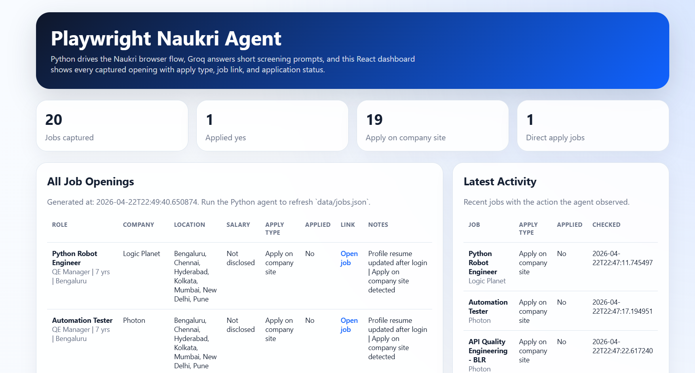

# Naukri AI Job Agent 🚀

A high-precision, AI-powered automation agent designed to streamline job applications on Naukri.com. Built with Python and Playwright, it leverages the **Groq Llama-3** model to intelligently answer screening questions and handle complex application flows.

## ✨ Features

- **Visual Dashboard**: A beautiful Next.js-powered dashboard to visualize your application history, success rates, and job details.

- **AI-Powered Screening**: Uses Groq (Llama-3-70b) to answer job-specific screening questions based on your unique resume.
- **Dynamic Chatbot Handling**: Automatically interacts with recruitment chatbots, handles multi-turn conversations, and types human-like responses.
- **Smart "Apply" Detection**: Advanced selectors to identify and interact with various application layouts, including standard forms and "Applied" state detection.
- **Resume Auto-Update**: Optionally refreshes your resume on the platform before starting the application loop.
- **Email Digest**: Sends a beautifully formatted HTML report of all jobs found, applied, and those requiring manual follow-up.
- **Bot Detection Bypass**: Implements stealth browser techniques to minimize automation detection.

## 🛠️ Tech Stack

- **Core**: Python 3.9+
- **Automation**: Playwright (Async)
- **AI Engine**: Groq API (Llama-3.3-70b-versatile)
- **Configuration**: Pydantic & Dotenv

## 🚀 Quick Start

### 1. Prerequisites
- Python installed
- A [Groq API Key](https://console.groq.com/)
- Playwright browsers installed: `playwright install chromium`

### 2. Setup
Clone the repository and install dependencies:
```bash
pip install -r requirements.txt
```

### 3. Configuration
Copy the `.env.example` to `.env` and fill in your details:
```bash
cp .env.example .env
```
Ensure you provide:
- `NAUKRI_EMAIL` & `NAUKRI_PASSWORD`
- `GROQ_API_KEY`
- `RESUME_PATH` (Absolute path to your PDF resume)

### 4. Usage
Run the agent:
```bash
python agent/main.py naukri
```

## 📋 How it Works

1. **Authentication**: Logs into Naukri using your credentials.
2. **Profile Refresh**: Navigates to your profile and re-uploads your resume to ensure you stay at the top of recruiter lists.
3. **Job Search**: Iterates through your configured job titles and locations.
4. **Intelligent Application**:
    - Opens job details.
    - Detects the application type.
    - If screening questions exist, it sends the question + your resume context to Groq.
    - Types the precise answer into the form.
    - Confirms successful submission.
5. **Reporting**: Generates a summary and sends an email digest if enabled.

## 🔒 Security & Privacy

- **Stealth Mode**: Uses custom headers and initialization scripts to appear like a regular user.
- **Credential Safety**: All sensitive data is stored in `.env` and excluded from git tracking.
- **Local Sessions**: Browser sessions are saved locally in `agent/data/` to avoid constant re-logins.

---
*Disclaimer: This tool is for educational and productivity purposes. Use responsibly and adhere to the terms of service of the job portals.*
